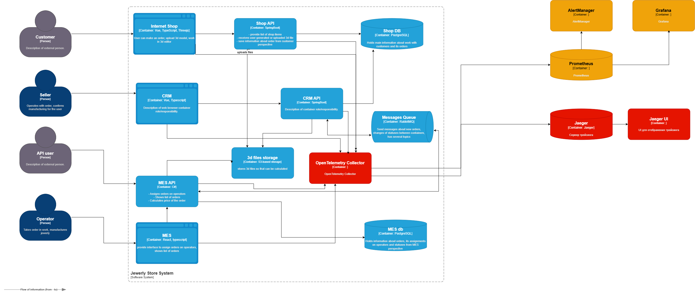

## Архитектурное решение по трейсингу

### Анализ диаграммы
1) Заказы могут потеряться или зависнуть в связке CRM API и MES API, в силу ненадежности реализации событийной интеграции с RabbitMQ.
2) Заказы могут потеряться или зависнуть в связке CRM API и MES API, в силу ненадежности реализации событийной интеграции с RabbitMQ.
3) Заказ может зависнуть на просчете стоимости в MES. 
4) Заказ может зависнуть на этапе выбора заказа оператором, ввиду медленной работы логики отображения заказов, старые заказы могут копиться и оставаться без внимания.

Нужно покрыть трейсингом все основные системы - все API, CRM, MES, RabbitMQ, S3

### Список данных
1) Идентификатор заказа orderId - позволит отследить путь заказа по всем системам
2) Идентификатор клиента clientId - позволит отследить заказы клиента по всем системам
3) trace_id
4) span_id
5) канал - B2B, B2C

### Мотивация
Трейсинг позволить создать основу для решения нескольких проблем компании:
1) Выявить системы, в которых регулярно пропадают или зависают заказы
2) Внести изменения в архитектуры без перегруза информацией о пути заказа, нет страха внедрить изменения, ломающие флоу заказа
3) Выявить системы, нуждающиеся в оптимизации
4) Сэкономить время и ресурсы на выявление и устранение проблем в случае сбоев и багов
5) Повысить общее качество и надежность систем

Позволит отслеживать следующие метрики:
1) время разбора обращения от жалобы до найденной причины
2) p95 времени прохождения заказа по этапам
3) доля инцидентов, локализованных поддержкой без эскалации на разработку
4) доля зависших заказов, обнаруженных автоматически, а не по жалобе.

### Предлагаемое решение
1) Для внедрения трейсинга необходимо доработать все API, сервисы, используя sdk OpenTelemetry, все трейсы будут отдаваться из сервисов в OpenTelemetry Collector.
2) В rabbitMq нужно пробрасывать traceparent, чтобы можно было отслеживать движение заказов и через него.

### Компромиссы
1) Простой заказа между статусами трейсингом не покрывается.
2) S3 и managed RabbitMQ инструментировать нельзя.Операции с ними видны только как клиентские спаны вызывающих сервисов
3) MES дорог в доработке, всего 1 разработчик, которорму еще нужно закрыть другие задачи по MES. При этом MES - главный подозреваемый, без него трейсинг закрывает только часть картины.
4) Трейсинг сам по себе не исправит проблемы исчезающих заказов

### Безопасность
1) Авторизация по ролям:
    - Поддержка: поиск трасс по orderId, просмотр трасс.
    - Разработка и DevOps: полный доступ, включая конфигурацию Collector.
    - Продакт и администраторы: только дашборды в Grafana, доступа в Jaeger нет.
    - Операторы и продавцы: доступа нет, им достаточно статуса заказа в CRM/MES.
2) Сетевая изоляция. Collector, Jaeger и Elasticsearch не публикуются в интернет, доступ только из внутренней сети или через VPN. 
3) Никаких персональных данных в трейсинге - только обезличенный clientId.
4) Jaeger UI не имеет встроенной аутентификации. Доступ закрывается nginx + oauth2-proxy с интеграцией в корпоративный SSO. Прямой порт Jaeger UI наружу не публикуется.

### Предлагаемое решение (доп задание)
1) Для алертирования необходимо настроить Prometheus, AlertManager и Grafana
2) Prometheus забирает метрики из OpenTelemetry Collector (spanmetrics connector), хранит и вычисляет alert rules: отсутствие спанов, error rate, p95 по этапам 
3) Grafana отображает мониторинг по трейсам
4) AlertManager получает срабатывания от Prometheus и маршрутизирует их:технические - дежурному разработчику, бизнесовые - продакту
5) 
